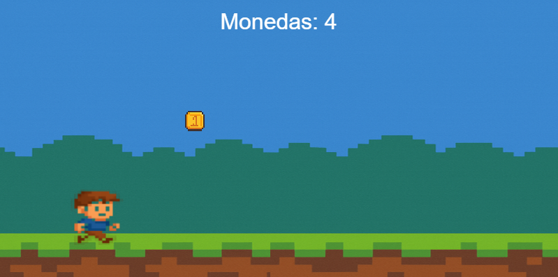

# [RunBoy](https://alextc35.github.io/runboy/) 




> Versión inicial de un mini juego estilo endless runner.

---

## 🎮 Controles

| Acción | Entrada                    |
|--------|-----------------------------|
| Saltar | `Espacio`, `↑`, o clic izquierdo del ratón |

---

## 🛠 Tecnologías

- 🎨 **HTML5 Canvas**
- ⚙️ **JavaScript ES6**

---

## 📦 Instalación local

```bash
git clone https://github.com/alextc35/runboy.git
cd runboy
```
Luego abre index.html en tu navegador.

---

## 👨‍💻 Autor

Hecho con ❤️ por [@alextc35](https://github.com/alextc35)  
Contribuciones, ideas o feedback son bienvenidos.
